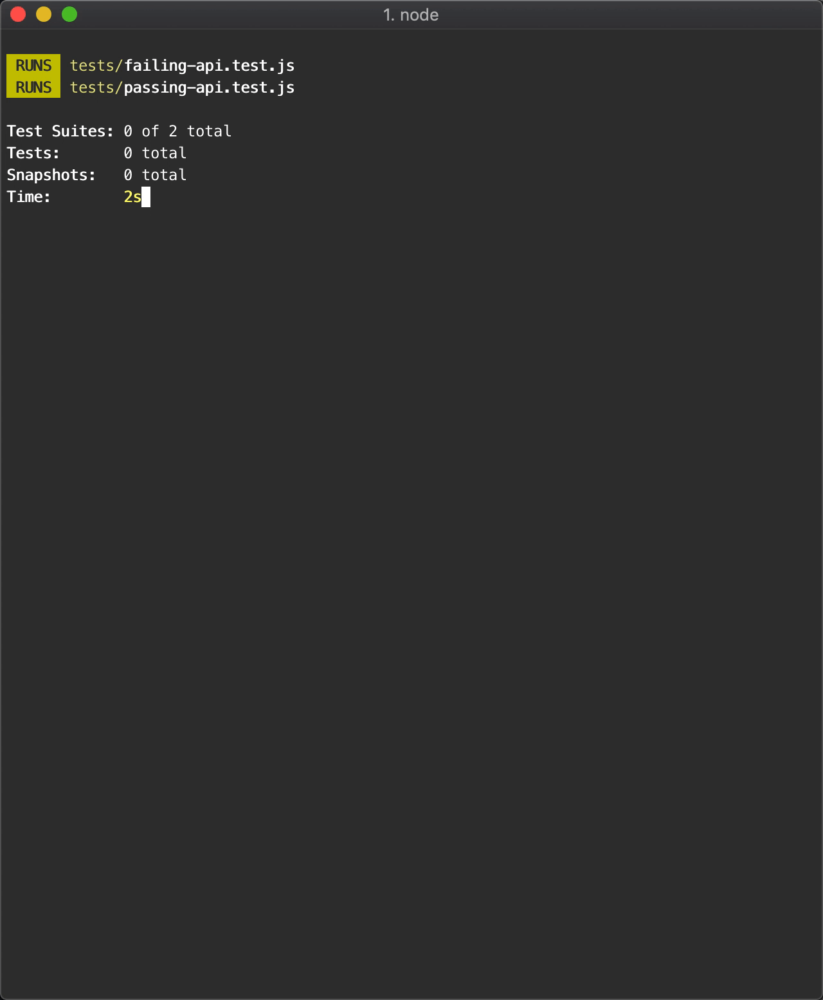

# Jest Runner Newman

[](https://travis-ci.org/fixate/jest-runner-newman)
[](https://badge.fury.io/js/jest-runner-newman)

A Jest runner for Postman's [Newman](https://github.com/postmanlabs/newman) CLI tool.

<p align="center">
  
</p>

<!-- START doctoc generated TOC please keep comment here to allow auto update -->
<!-- DON'T EDIT THIS SECTION, INSTEAD RE-RUN doctoc TO UPDATE -->
**Table of Contents**

- [Purpose](#purpose)
- [Install](#install)
- [Running tests](#running-tests)
- [License](#license)

<!-- END doctoc generated TOC please keep comment here to allow auto update -->

## Purpose

Easily run automated tests for your Postman collections using Newman and Jest.

## Install

```bash
$ npm install -D jest-runner-newman
```

```javascript
# jest.newman.js

module.exports = {
  displayName: 'newman',
  testMatch: ['<rootDir>/path/to/tests/**.test.js'],
  runner: 'jest-runner-newman',
}
```

```bash
npx jest -c jest.newman.js
```

## Running tests

`jest-runner-newman` runs Newman tests in Node child processes. In addition to
running a Newman test via the `newman` module, each test needs to send the
parent process the result of the test run. To make this easier,
`jest-runner-newman` exports a separate module to specifically handle that:

```javascript
# my-collection.test.js

const {handleResult} = require('jest-runner-newman/handle-result')
const newman = require('newman');

module.exports = newman.run({
  collection: `[collection-url]`,
  environment: `[envinroment-url]`,
  reporters: ['cli'],
  // any other newman configs
}, (err, result) => {
  handleResult(err, result);

  // anything else you want
})
```

## License

MIT
